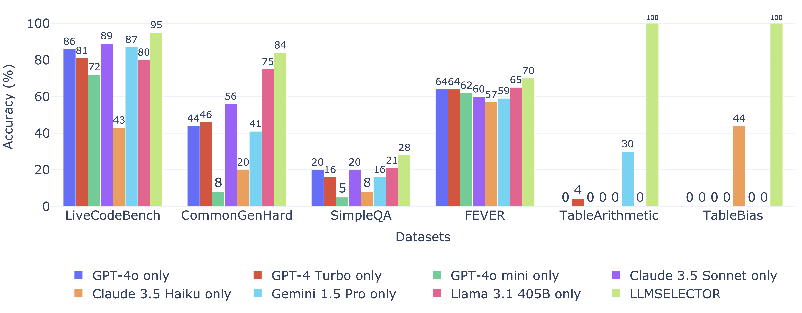

# 🎓 LLMSELECTOR: Which models to use for your compound AI systems?

[Original Repository](https://github.com/LLMSELECTOR/LLMSELECTOR)

Researchers and developers are increasingly invoking multiple LLM calls in a compound AI system to solve complex tasks. But which LLM should one select for each call? 

LLMSELECTOR is a framework that automatically optimizes model selection for compound AI systems!

TLDR: You only need to design your compound system's workflow, and selecting which LLM to use is on LLMSELECTOR.

## 🚀 What does LLMSELECTOR offer?


<p align="center">
  
</p>
<p align="left">
  <b>Figure 1:</b> Comparison of using any fixed model and LLMSELECTOR for different compound AI systems. We find that, perhaps surprisingly, allocating different models to different modules can improve the overall performance by 5-70%.
</p>

Compound AI systems that involve multiple LLM calls are widely studied and developed in academy and industry. But does calling different LLMs in these systems make a difference? As suggested in Figure 1, the difference can be significant, and no LLM is the universally best choice. This leads to an important question: which LLM should be selected for each call in a compound system? The search space is exponential and exhaustive search is cumbersome.  

LLMSELECTOR automates LLM selection in compound AI systems. As shown in Figure 1, LLMSELECTOR offers substantial performance gains on popular compound systems (such as self-refine and multi-agent-debate): perhaps surprisingly, it can offer 5-70% performance improvement over using any fixed LLMs for all modules in a compound system.

Here, we provide a tutorial on how to use LLMSELECTOR, including the installation, a few examples, and guidance on how to extend it for customized compound AI systems. 

## 💻 How to Use LLMSELECTOR?
#### 🔧 Installation
You can install LLMSELECTOR by running the following commands:

```
git clone https://github.com/LLMSELECTOR/LLMSELECTOR
cd LLMSELECTOR
pip install -e ./llmselector
```
 
#### 💡 Quickstart (No API key needed)

To start, let us first set up the environment.

```python
import llmselector
if not os.path.exists('../cache/db_livecodebench.sqlite'): 
    !wget -P ../cache https://github.com/LLMSELECTOR/LLMSELECTOR/releases/download/0.0.1/db_livecodebench.sqlite
llmselector.config.config(
    db_path=f"../cache/db_livecodebench.sqlite" )
```

Next, let us load the livecodebench dataset.

```python
from llmselector.data_utils.livecodebench import DataLoader_livecodebench 
from sklearn.model_selection import train_test_split
Mydataloader = DataLoader_livecodebench()
q_data = Mydataloader.get_query_df()
train_df, test_df = train_test_split(q_data,test_size=0.5, random_state=2025)
```

Let us first evaluate self-refine systems using fixed models.

```python
from llmselector.compoundai.optimizer import OptimizerFullSearch
from llmselector.compoundai.metric import Metric, compute_score
model_list = ['gpt-4o-2024-05-13','claude-3-5-sonnet-20240620','gemini-1.5-pro']
Agents_SameModel ={}
for name in model_list:
    Agents_SameModel[name] = SelfRefine()
    Opt0 = OptimizerFullSearch(model_list = [name])
    Opt0.optimize( train_df, Metric('em'), Agents_SameModel[name])
results = compute_score(Agents_SameModel, test_df, Metric('em'))
print(results)
```
The expected output is 

| Name                     | Mean_Score |
|--------------------------|------------|
| gpt-4o-2024-05-13        | 0.862500   |
| claude-3-5-sonnet-20240620 | 0.891667   |
| gemini-1.5-pro           | 0.866667   |


Now, let us use LLMSELECTOR to optimize the system.

```python
from llmselector.compoundai.optimizer import OptimizerLLMDiagnoser
LLMSELECTOR = SelfRefine()
Optimizer = OptimizerLLMDiagnoser()
Optimizer.optimize( train_df, Metric('em'), LLMSELECTOR)
results = compute_score({"LLMSELECTOR":LLMSELECTOR}, test_df, Metric('em'))
print(results)
```
The expected output should be

| Name                     | Mean_Score |
|--------------------------|------------|
|  LLMSELECTOR             |   0.954167 |

I.e., LLMSELECTOR offers a notable performance gain (6%) compared to always using any fixed model.

#### 📖 More examples (No API key needed)

More examples can be found in ```examples/```.

#### 🌐 Customized systems and tasks (API keys needed)

To use LLMSELECTOR for your own compound AI systems and tasks, it is as easy as creating the systems and tasks and then invoking LLMSELECTOR.

- Create your system: create the components and pipelines similar to SelfRefine defined in ```compoundai/module/selfrefine```

- Create your task: create a DataLoader object similar to these in ```data_utils```


- Invoke LLMSELECTOR: You can simply use LLMSELECTOR by 
```Optimizer.optimize(train_df,Metric('em'),your_compound_system)```

Note that you will need to set up API keys for your own systems. To do so, you can simply use 

```
llmselector.config.config(
	db_path=f"cache.sqlite" ,
	openai_api_key="YOUR_OPENAI_KEY",
	anthropic_api_key="YOUR_ANTHROPIC_KEY",
	together_ai_api_key="YOUR_TOGETHERAI_KEY",
	gemini_api_key="YOUR_GEMINI_KEY")
```
    
## ✨ Can I request features and contribute?

Yes! We are happy to hear from you. Please feel free to open an issue for any feature request.

If you are interested in contributing, we would also be happy to coordinate on ongoing efforts! Please send an email to Lingjiao (lingjiao [at] stanford [dot] edu) 


## 📣 Updates & Changelog


### 🔹 2025.02.21 - The project is alive now!

  - ✅ Release the codebase, relevant examples, and demos

    
## 🎯 Reference

If you find LLMSELECTOR useful, we would appreciate if you can please cite our work as follows:


```
@article{chen2025llmselector,
  title={Optimizing Model Selection for Compound AI Systems},
  author={Chen, Lingjiao and Davis, Jared and Hanin, Boris and Bailis, Peter and Zaharia, Matei and Zou, James and Stoica, Ion},
  journal={arXiv},
  year={2025}
}
```
